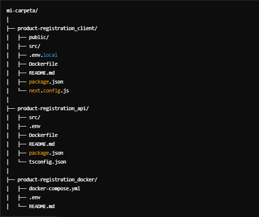
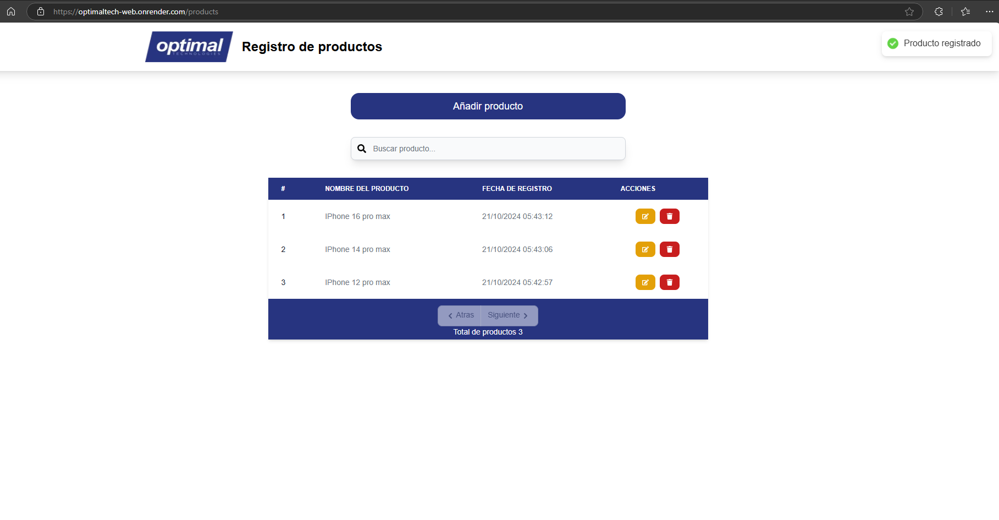

<p align="center">
  <a href="http://nestjs.com/" target="blank"></a>
</p>

# Inicializar Front y Back

1. Tener Docker instalado
- [Docker install](https://docs.docker.com/desktop/install/windows-install/)

2. Clonar los repositorias al mismo nivel que este
- [Front](https://github.com/Berserker04/product-registration_client)
- [Back](https://github.com/Berserker04/product-registration_api)

Ejemplo de como deberia quedar:



3. Ejecuta el docker-compose
```
docker-compose -f docker-compose.prod.yaml up -d --build
```

4. Prueba ingresando al portal
```
http://localhost:3000/products
```

## Stack usado
* Next Js
* Nest Js
* Postgres

# Production Build
1. Crear el archivo ```.env.prod```
2. Llenar las variables de entorno de prod
3. Crear la nueva imagen
```
docker-compose -f docker-compose.prod.yaml --env-file .env.prod up --build
```

# Despliegue
Desplegar imagen en plataformas como:

[Render](https://render.com/)

[Digital Ocean](https://www.digitalocean.com/)

# Documentation api
Prueba la api con los diferentes endpoints:

[Documentación api](https://documenter.getpostman.com/view/11322676/2sAXxY38ey)

# Link de la api en produción
Puedes probar con la api ya desplegada:

https://optimaltech-api-0-1.onrender.com/api

# Nota
recuerda el prefijo ```api``` para poder hacer las peticiones

# Link de la web en produción
Puedes probar con la web ya desplegada:

https://optimaltech-web.onrender.com/

# Vista en produción

